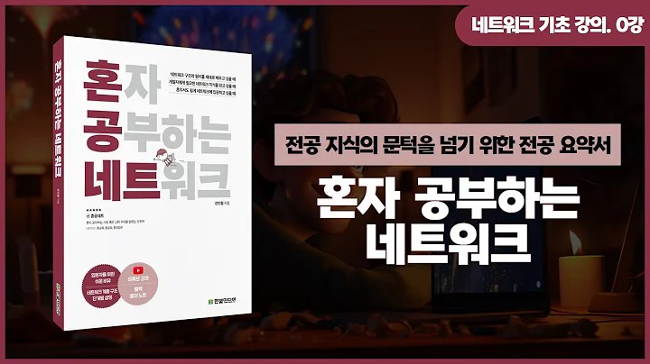

## 혼자 공부하는 네트워크

### 유튜브 강의 (하단 이미지 클릭)

### 추가 자료 목록

- [ethertypes](https://github.com/kangtegong/self-learning-cs2/tree/main/ethertypes)
- [encoding](https://github.com/kangtegong/self-learning-cs2/tree/main/encoding)
- [wireshark-filters](https://github.com/kangtegong/self-learning-cs2/tree/main/wireshark-filters)	
- [packets](https://github.com/kangtegong/self-learning-cs2/tree/main/packets)

### 추가 문의가 있다면?

본 심화 학습 저장소에 보완할 내용이 있거나 

추가 설명이 필요한 내용이 있다면

[issues](https://github.com/kangtegong/self-learning-cs2/issues)에 질문을 남겨주시거나 **tegongkang at gmail dot com** 으로 문의 보내주세요. 

문의에 답해드리거나 추가 자료를 제작해드리겠습니다.

